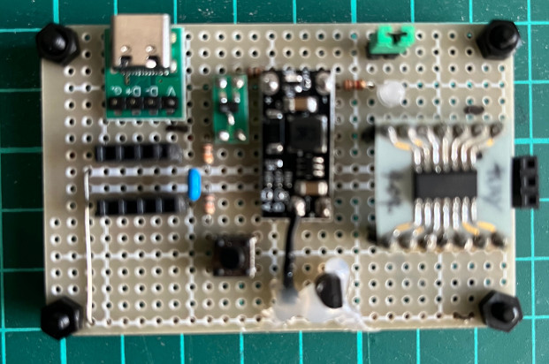
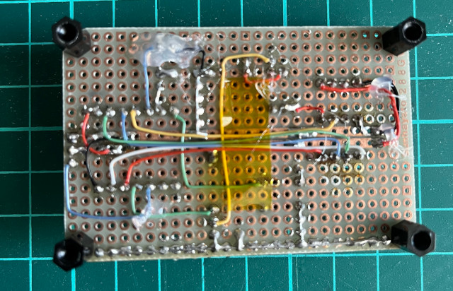
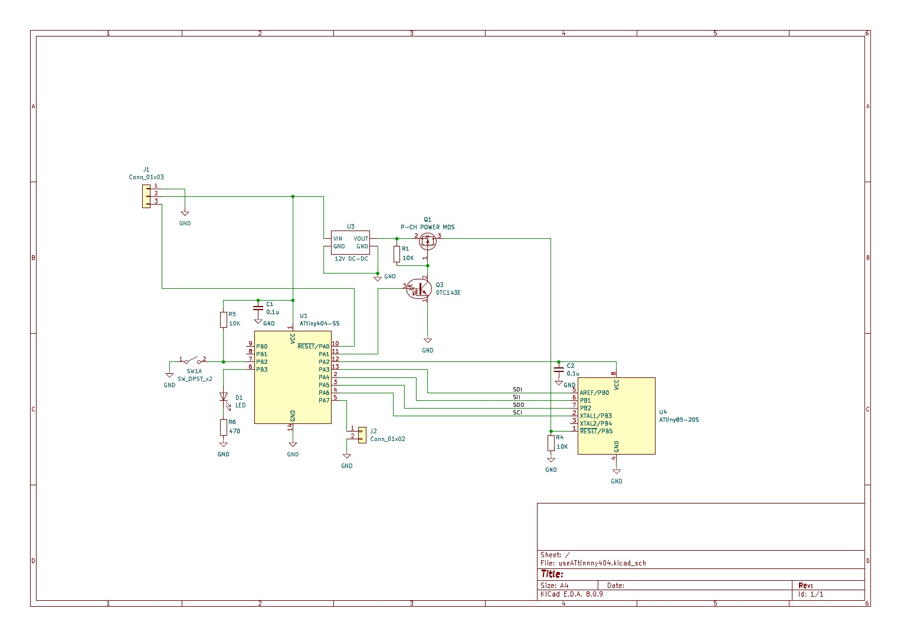

# ATtiny85fuse-resetter
A fuse resetter for microchip ATtiny85

ATtiny85のRESETnピンをユーザーIOとして使用するにはavrdudo等を使用して上位FuseバイトのRSTDISBLビットを'0'に書き換えます。ただしその状態ではSPIバスを介した通常のプログラム書き換えはできません。そこでRESETn端子に12Vのパルスを加え高電圧直列プログラミングを実行することでFuseを書き換え、再び通常のプログラム書き換えができる状態に戻すことが求められます。
本プロジェクトは高電圧直列プログラミングによりATtiny85のFuseを書き換えてデバイスを再プログラミング可能にするためのハードウェア例とソフトウェア例を提供します。

## 参考としたプロジェクト
[ATtiny85 Powered High Voltage AVR Programmer](https://www.hackster.io/sbinder/attiny85-powered-high-voltage-avr-programmer-3324e1)<br>
高電圧直列プログラミング部分はこちらのコードをほぼそっくり使わせていただいています。

## ハードウェア
ユニバーサル基板と手持ちの部品を使用して製作


回路図

制御用マイコンにはATtiny404を使用<br>
12V生成用としてAliexpressで購入したDC-DCブーストコンバータを使用<br>
12Vパルス生成はP-MOSFETのゲートをデジトラで制御<br>
ターゲットの5V電源をATtiny404のIOから直接供給<br>

## ソフトウェア
Arduinno + megaTinyCoreを利用<br>
フラッシュ使用量は1628バイト（39%）<br>

## 使用方法
1. 8ピンのソケットにターゲットデバイスを装着
2. USB-TypeCコネクタから5Vを供給（青LEDが点滅）
3. 青LED消灯を待ってタクトスイッチをプッシュ
4. 正常にFuseの書き換えが完了すると青LEDが点灯
5. エラー発生時は青LEDが高速点滅
### オプション
1. ショートピン装着でRSTDISBLビットのみを初期化
2. ショートピンオープンで全Fuseを初期化

## 実行例
```
 [全初期化後]
$ avrdude -c usbasp -p t85 -U lfuse:r:-:h -U hfuse:r:-:h -U efuse:r:-:h -n -B 125kHz

avrdude: set SCK frequency to 93750 Hz
avrdude: AVR device initialized and ready to accept instructions
avrdude: device signature = 0x1e930b (probably t85)
avrdude: reading lfuse memory ...
avrdude: writing output file <stdout>
0x62
avrdude: reading hfuse memory ...
avrdude: writing output file <stdout>
0xdf
avrdude: reading efuse memory ...
avrdude: writing output file <stdout>
0xff

avrdude done.  Thank you.


 [ブートローダ書き込み後]
$ avrdude -c usbasp -p t85 -U lfuse:r:-:h -U hfuse:r:-:h -U efuse:r:-:h -n

avrdude: AVR device initialized and ready to accept instructions
avrdude: device signature = 0x1e930b (probably t85)
avrdude: reading lfuse memory ...
avrdude: writing output file <stdout>
0xe2
avrdude: reading hfuse memory ...
avrdude: writing output file <stdout>
0xdf
avrdude: reading efuse memory ...
avrdude: writing output file <stdout>
0xfe

avrdude done.  Thank you.


 [RSPDISB = 0でPB5をユーザー端子とする]
$ avrdude -c usbasp -p t85 -U hfuse:w:0x5f:m

avrdude: set SCK frequency to 93750 Hz
avrdude: AVR device initialized and ready to accept instructions
avrdude: device signature = 0x1e930b (probably t85)
avrdude: reading input file 0x5f for hfuse
         with 1 byte in 1 section within [0, 0]
avrdude: writing 1 byte hfuse ...
avrdude: 1 byte of hfuse written
avrdude: verifying hfuse memory against 0x5f
avrdude: 1 byte of hfuse verified

avrdude done.  Thank you.


 [RSPDISB = 0の状態]
$ avrdude -c usbasp -p t85 -U lfuse:r:-:h -U hfuse:r:-:h -U efuse:r:-:h -n -B 125kHz

avrdude: set SCK frequency to 93750 Hz
avrdude error: program enable: target does not answer (0x01)
avrdude error: initialization failed, rc=-1
        - double check the connections and try again
        - use -B to set lower ISP clock frequency, e.g. -B 125kHz
        - use -F to override this check


avrdude done.  Thank you.


 [RSPDISBL = 1に戻す(他のビットはそのまま)]
$ avrdude -c usbasp -p t85 -U lfuse:r:-:h -U hfuse:r:-:h -U efuse:r:-:h -n

avrdude: AVR device initialized and ready to accept instructions
avrdude: device signature = 0x1e930b (probably t85)
avrdude: reading lfuse memory ...
avrdude: writing output file <stdout>
0xe2
avrdude: reading hfuse memory ...
avrdude: writing output file <stdout>
0xdf
avrdude: reading efuse memory ...
avrdude: writing output file <stdout>
0xfe

avrdude done.  Thank you.
```